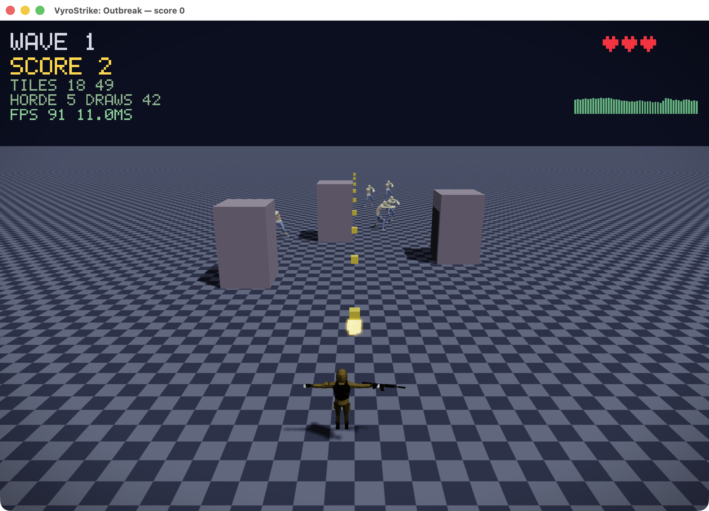
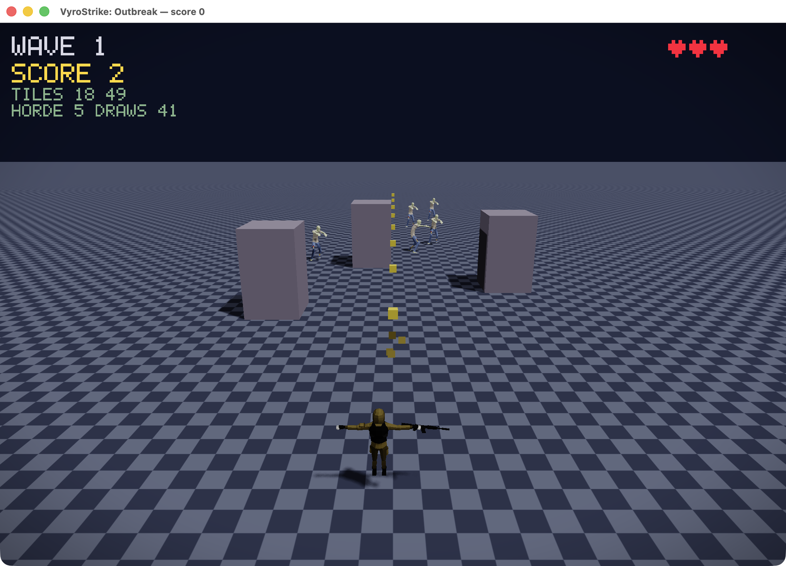
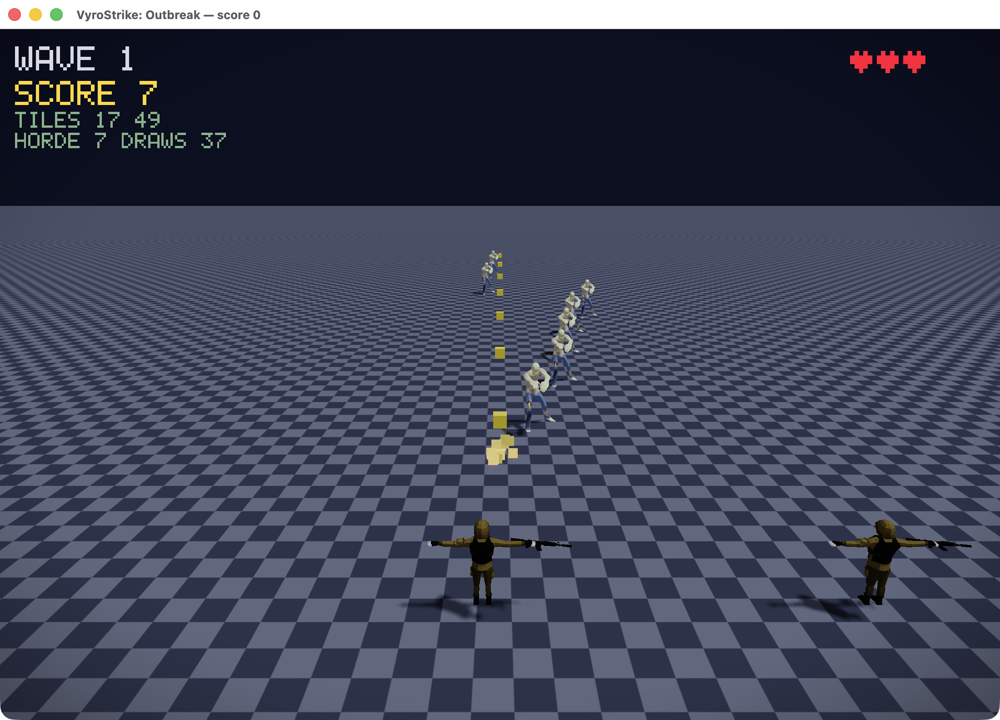
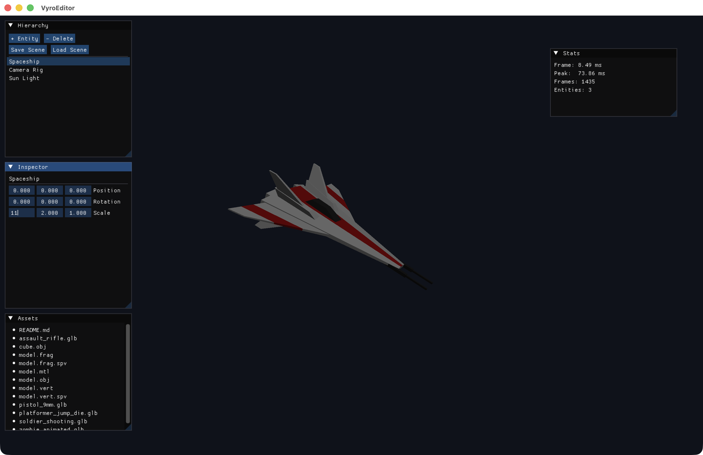
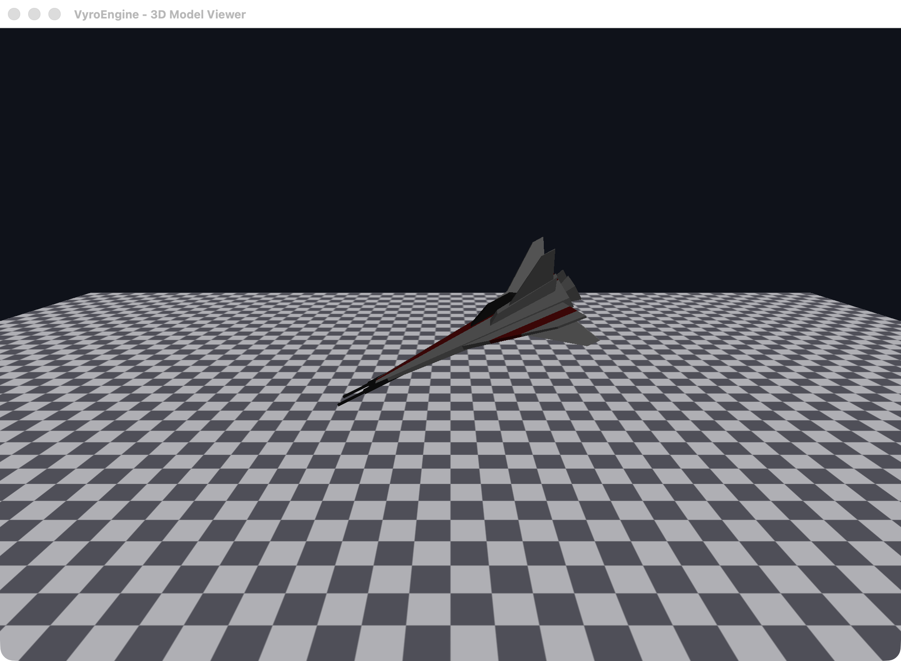
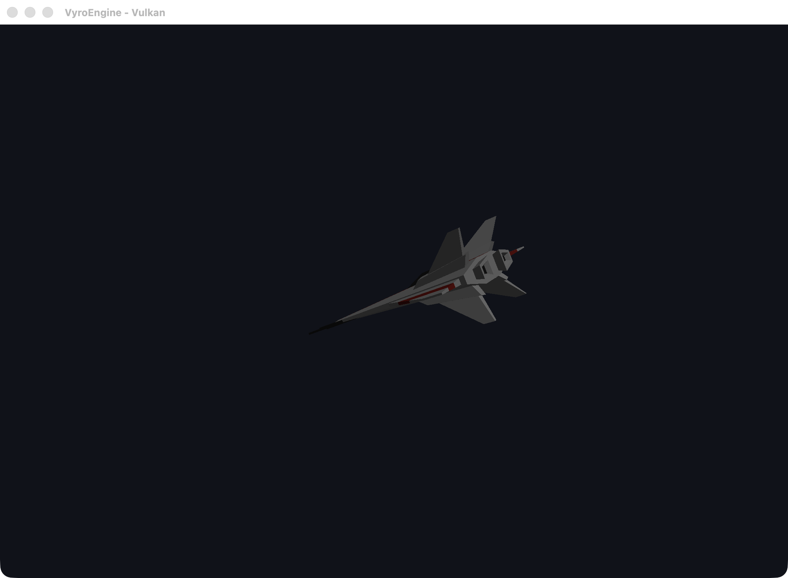
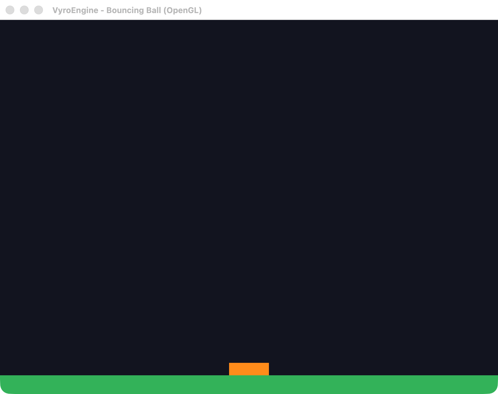

# VyroEngine

> A high-performance, cross-platform game engine built from scratch — engineered for the next generation of interactive experiences.

---

## Vision

VyroEngine is an open-architecture, data-driven game engine designed to give developers full control over every layer of the stack — from memory allocators to rendering pipelines. Built with a philosophy of **transparency over magic**, VyroEngine exposes its internals, avoids hidden systems, and prioritizes predictable performance.

Think: the openness of Godot, the performance ceiling of Unreal, and the accessibility of Unity — built ground-up with modern C++23 and Vulkan-first rendering.

---

## Status

**🎉 v1.0.0 is complete and released** — all 12 development phases (foundation,
ECS, rendering, physics, audio, animation, scripting, editor, networking,
advanced graphics, optimization, production) shipped, tested, and packaged.
See the [v1.0.0 release](https://github.com/Gaurav06120714/VyroEngine/releases/tag/v1.0.0).

**✅ VyroEngine 2.0 is complete and released** — visual editor (ImGui), UDP
networking, Lua scripting, a real Vulkan backend (MoltenVK), texturing, and a
GLB/glTF model loader. See the
[v2.0.0 release](https://github.com/Gaurav06120714/VyroEngine/releases/tag/v2.0.0).

**🎉 VyroEngine 3.0 is complete and released** — the game-maker era:
skeletal animation, animated gameplay, real audio output, on-screen text/HUD,
and scene authoring. See the
[v3.0.0 release](https://github.com/Gaurav06120714/VyroEngine/releases/tag/v3.0.0).

**🎉 VyroEngine 4.0 is complete and released** — the juice & performance era:
particle systems, audio files & looping music, animation blending, UDP co-op,
and a follow camera with screen shake and post-FX. See the
[v4.0.0 release](https://github.com/Gaurav06120714/VyroEngine/releases/tag/v4.0.0).
Full plan: [docs/ROADMAP_V4.md](docs/ROADMAP_V4.md).

**🎉 VyroEngine 5.0 is complete and released** — the rendering & worlds era:
offscreen HDR rendering with bloom, real-time shadows, a larger frustum-culled
world, steering-based horde AI, and single-call draw batching. See the
[v5.0.0 release](https://github.com/Gaurav06120714/VyroEngine/releases/tag/v5.0.0).
Full plan: [docs/ROADMAP_V5.md](docs/ROADMAP_V5.md).

**🎉 VyroEngine 6.0 is complete and released** — the production-grade era: true
GPU hardware instancing, a depth-texture shadow pipeline, networked co-op
gameplay, an authored level/obstacle pipeline, and an on-screen performance
profiler. See the
[v6.0.0 release](https://github.com/Gaurav06120714/VyroEngine/releases/tag/v6.0.0).
Full plan: [docs/ROADMAP_V6.md](docs/ROADMAP_V6.md).

**🎉 VyroEngine 7.0 is complete and released** — the gameplay-depth era: varied
horde animation, walker/runner/brute enemies, pistol/rifle/shotgun weapons,
spatial audio, and wave objectives with victory/defeat. See the
[v7.0.0 release](https://github.com/Gaurav06120714/VyroEngine/releases/tag/v7.0.0).
Full plan: [docs/ROADMAP_V7.md](docs/ROADMAP_V7.md).

**🎉 VyroEngine 8.0 is complete and released** — the content & persistence era:
saved high scores & settings, health/ammo/score pickups, run stats, difficulty
modes, and data-driven waves. See the
[v8.0.0 release](https://github.com/Gaurav06120714/VyroEngine/releases/tag/v8.0.0).
Full plan: [docs/ROADMAP_V8.md](docs/ROADMAP_V8.md).

**🎉 VyroEngine 9.0 is complete and released** — the progression & bosses era:
credits, a between-wave upgrade shop, boss enemies, a combo multiplier, and
medals. See the
[v9.0.0 release](https://github.com/Gaurav06120714/VyroEngine/releases/tag/v9.0.0).
Full plan: [docs/ROADMAP_V9.md](docs/ROADMAP_V9.md).

**🎉 VyroEngine 10.0 is complete and released** — the variety & polish era:
environmental hazards, boss phases, weapon unlocks, timed power-ups, and a title
menu. See the
[v10.0.0 release](https://github.com/Gaurav06120714/VyroEngine/releases/tag/v10.0.0).
Full plan: [docs/ROADMAP_V10.md](docs/ROADMAP_V10.md).

---

## Games built on VyroEngine

| Game | Description | Run |
|------|-------------|-----|
| **VyroStrike: Outbreak** | 3D zombie shooter: you are the soldier, gun down the shambling horde. ECS + Input + collision + GLB character models + GL rendering. | `./build/bin/VyroStrike` |

Controls: **A/D** move · **Space** shoot · **R** restart · **Esc** quit

---

## Apps & how to use them

Build once, then run any app from `build/bin/`:

```bash
cmake -B build -G Ninja -DCMAKE_BUILD_TYPE=Release && cmake --build build
ctest --test-dir build      # 52 test suites, all green
```

| App | What it is | How to use |
|-----|------------|------------|
| `VyroStrike` | The game — showcases every engine feature | **A/D** move · **Space** shoot · **R** restart · **Esc** quit. `VYRO_AUTOFIRE=1` auto-shoots. Co-op: run `VYRO_COOP=host` and `VYRO_COOP=join` on localhost. |
| `VyroEditor` | ImGui scene editor | Select entities in the hierarchy, edit transform in the inspector, **+Entity / -Delete**, **Save / Load Scene**; live Stats panel. |
| `vyro_model` | OpenGL 3D model viewer (OBJ) | Just run it — renders the textured model on a checker floor. |
| `vyro_vulkan` | Same model through the real **Vulkan** (MoltenVK) backend | Just run it — proves the Vulkan RHI path. |
| `vyro_window` | OpenGL physics demo — a box bouncing on the floor | Just run it. |
| `vyro_bounce` | Headless physics demo — ASCII bounce trace | Run in a terminal (no window). |
| `VyroEngine` | Headless engine smoke test — prints version + ticks | Run in a terminal; verifies the core lifecycle. |

### Screenshots

**VyroStrike: Outbreak** — HDR bloom, real-time shadows, frustum-culled world, horde AI, instancing, and an on-screen profiler:



**Level obstacles** (pillars cast shadows, block the soldier, divert the horde) · **Co-op** (two players, shared world):




**VyroEditor** · **3D model viewer** · **Vulkan backend** · **physics demo**:






More per-phase screenshots live in [`docs/screenshots/`](docs/screenshots/).

---

## Documentation Index

| File | Description |
|------|-------------|
| [V1.md](V1.md) | Software Requirements Specification (SRS) |
| [V2.md](V2.md) | Architecture Plan & System Design |
| [V3.md](V3.md) | Development Roadmap — Phases 0–6 |
| [V4.md](V4.md) | Development Roadmap — Phases 7–12 |
| [V5.md](V5.md) | Dependency Graph, Team Structure, Folder Architecture |
| [V6.md](V6.md) | Timelines, Risk Analysis & Final Architecture Diagram |
| [rulz/](rulz/) | Engineering Rules & Coding Standards |

---

## Quick Start (Future)

```bash
git clone https://github.com/Gaurav06120714/VyroEngine.git
cd VyroEngine
cmake -B build -DCMAKE_BUILD_TYPE=Release
cmake --build build
```

---

## Tech Stack

| Layer | Technology |
|-------|-----------|
| Language | C++23 |
| Build System | CMake 3.28+ |
| Rendering (Primary) | Vulkan 1.3 |
| Rendering (Fallback) | OpenGL 4.6 |
| Scripting | Lua 5.4 / LuaJIT |
| Physics | Custom + Bullet3 integration |
| Audio | OpenAL / miniaudio |
| UI Framework | Dear ImGui (Editor) |
| Windowing | SDL3 / GLFW |
| Asset Pipeline | Custom + Assimp |

---

## Supported Platforms (Roadmap)

- Windows 10/11 (Primary)
- Linux (Ubuntu 22.04+)
- macOS 13+ (Metal fallback)
- WebAssembly (future)
- Console (future)

---

## Repository Structure

```
VyroEngine/
├── engine/          # Core engine source
├── editor/          # VyroEditor source
├── runtime/         # Game runtime
├── tools/           # Build tools, asset pipeline
├── samples/         # Sample games and demos
├── docs/            # Technical documentation
├── tests/           # Unit and integration tests
├── rulz/            # Engineering standards and rules
├── CMakeLists.txt
└── README.md
```

---

## License

MIT License — see [LICENSE](LICENSE)

---

## Author

**Gaurav** — Principal Architect, VyroEngine  
Part of the [VyroEcosystem](https://github.com/Gaurav06120714)
